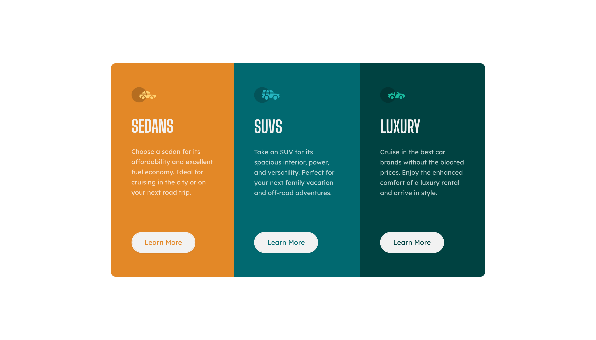

# Frontend Mentor - 3-column preview card component solution

This is Max Ruuen's solution to the [3-column preview card component challenge on Frontend Mentor](https://www.frontendmentor.io/challenges/3column-preview-card-component-pH92eAR2-). Frontend Mentor challenges help you improve your coding skills by building realistic projects.

## Table of contents

- [Overview](#overview)
  - [The challenge](#the-challenge)
  - [Screenshot](#screenshot)
  - [Links](#links)
- [My process](#my-process)
  - [Built with](#built-with)
  - [What I learned](#what-i-learned)
  - [Continued development](#continued-development)
  - [Useful resources](#useful-resources)
- [Author](#author)
- [Acknowledgments](#acknowledgments)

## Overview

### The challenge

Users should be able to:

- View the optimal layout depending on their device's screen size
- See hover states for interactive elements

### Screenshot

##### Desktop Solution



##### Mobile Solution


### Links

- Solution URL: [Frontendmentor.io]()
- Live Site URL: [Netlify](https://rd-challenge-3-column-card.netlify.app/)

## My process

### Built with

- HTML5 / CSS
- SASS
- Flexbox

### What I learned

This was a simple but fun challenge to complete, which also allowed me to discover my love of the & ampersand operator in SASS. I think this has made the implementation of each specific card class and associated hover styles much more readable.

Previously I would have structured it as follows:

```css
.card__container {
  ...;
}

.card__container-sedans-card {
  ...;
}

.card__container-suvs-card {
  ...;
}

.card__container-luxury-card {
  ...;
}
```

Now I have structured it:

```css
.card__container {
  ...;

  &-sedans-card {
    ...;
  }

  &-suvs-card {
    ...;
  }

  &-luxury-card {
    ...;
  }
}
```

I think this project also has my best usage of BEM class naming structure yet, but still far from perfect. I can benefit from a lot more exposure to other projects utilising BEM to learn more.

A small challenge was when I experienced an issue with the cards in desktop layout, where wrapping of the card copy text would cause misalignment of the card buttons.

I knew that I could flex the card container in column direction, and then apply something to force push the buttons to the bottom of the card, but I believed that I could not use `margin: auto` on the y-axis due to an incorrect piece of information I read previously.

After some perseverence and googling, I was surprised to find that I can indeed utilise auto margins on y-axis. Cool as!
I was then able to resolve with the below solution:

- Apply flex to the card containers in column direction
- Set card `height: 100%` to force matching of container height
- Applied `margin-top: auto` on the card buttons to force them down to bottom of the container, resolving the problem.

Thanks to [@Robert-Rynard](https://www.frontendmentor.io/profile/Robert-Rynard) on Frontend Mentor for suggesting a better solution for the border curvature. I have now moved to applying `border-radius: 10px` and `overflow: hidden` to the `.page__container` card parent element, rather than specifying different radius values for the first and last card (which then needed adjustment in media query).

## Author

- Frontend Mentor - [@ruuendigital](https://www.frontendmentor.io/profile/ruuendigital)
- Twitter - [@maxruuen](https://www.twitter.com/maxruuen)
